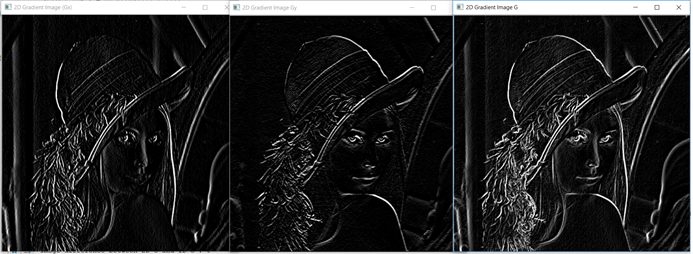
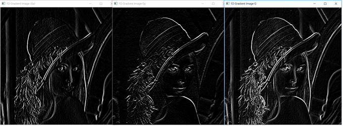
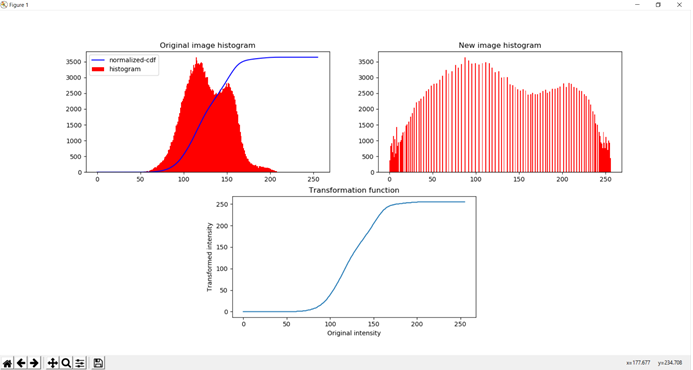
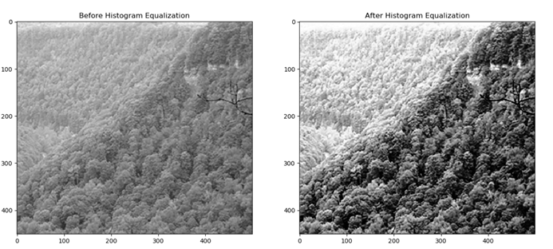

# CSE-573-Computer_Vision_Image_Processing
Projects on Computer Vision and Image Processing
##
## 1) Edge Detection [Repo..](edge-detection)
**Problem:** Detect edges of a grayscale image using 2D and 1D Sobel Filter

**Approach:**
The project applies 2D and 1D Sobel Filter on lena_gray.jpg (grayscale) image and compares the performance [edge-detection.py](edge-detection/edge-detection.py).

**Sample outputs:** Input image: 

Edge detection using 3x3 2D convolution: 

Edge detection using 3x3 1D convolution: 

##
## 2) Image Enhancement [Repo..](image-enhancement)
**Problem:** Enhance contrast of image intensities

**Approach:**
The project applies Histogram equalization technique for adjusting intensities of image to enhance contrast [histogram-equalization.py](image-enhancement/histogram-equalization.py).

**Sample outputs:** 

Image Histogram:

Enchanced Image:

##
## 3) Depth Estimation [Repo..](depth-estimation)
**Problem:** Estimate the depth of objects in given scene using stereo images

**Approach:** The project estimates the disparity of objects in given scene using 3x3 and 9x9 block matching technique. The two stereo images are taken as the input to calculate the disparity. The object with higher pixel intensity in final image would closer to camera.

##
## 4) View Synthesis [Repo..](view-synthesis)
**Problem:** Create centeral view from two stereo images

**Approach:** In progress

##
## 5) Image Segmentation [Repo..](image-segmentation)
**Problem:** Perform image segmentation for given image using color and spetial similarity

**Approach:** The project estimates the disparity of objects in given scene using 3x3 and 9x9 block matching technique. The two stereo images are taken as the input to calculate the disparity. The object with higher pixel intensity in final image would closer to camera.

