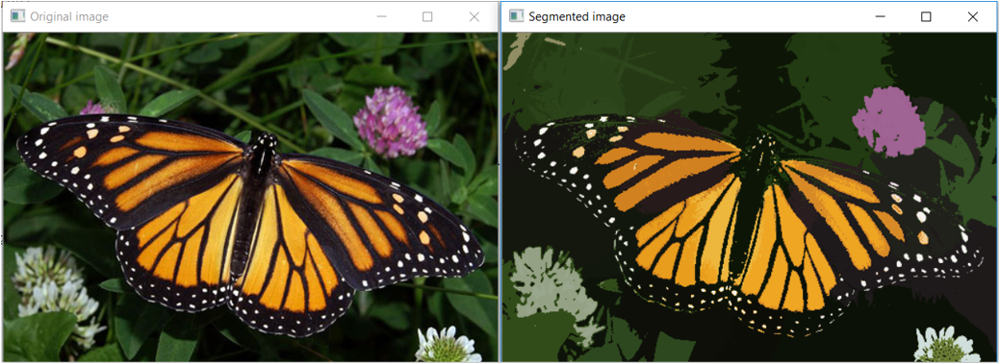
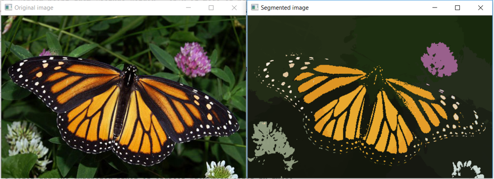
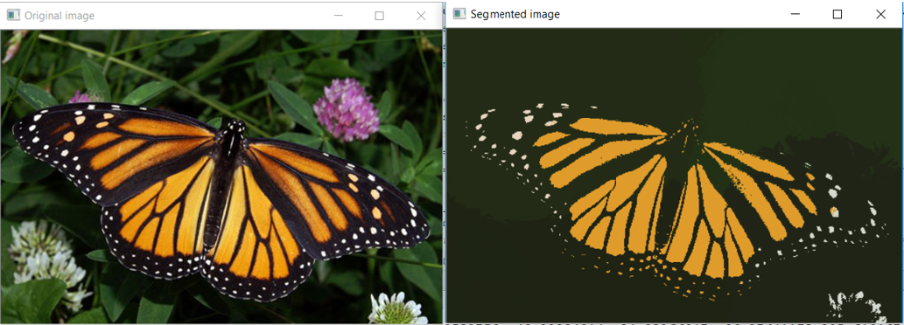

##  Image Segmentation 
**Problem:** Perform image segmentation for given image using color and spetial similarity

**Approach:** Implemented mean-shift algorithm based on 4 dimensional features (rgb and distance) to partition image into segmentation.

[image-segmentation.py](image-segmentation.py)

**Input image:**

**Output Images:**

Segmented using h = 60 and shift = 1

Segmented using h = 90 and shift = 1

Segmented using h = 120 and shift = 1

